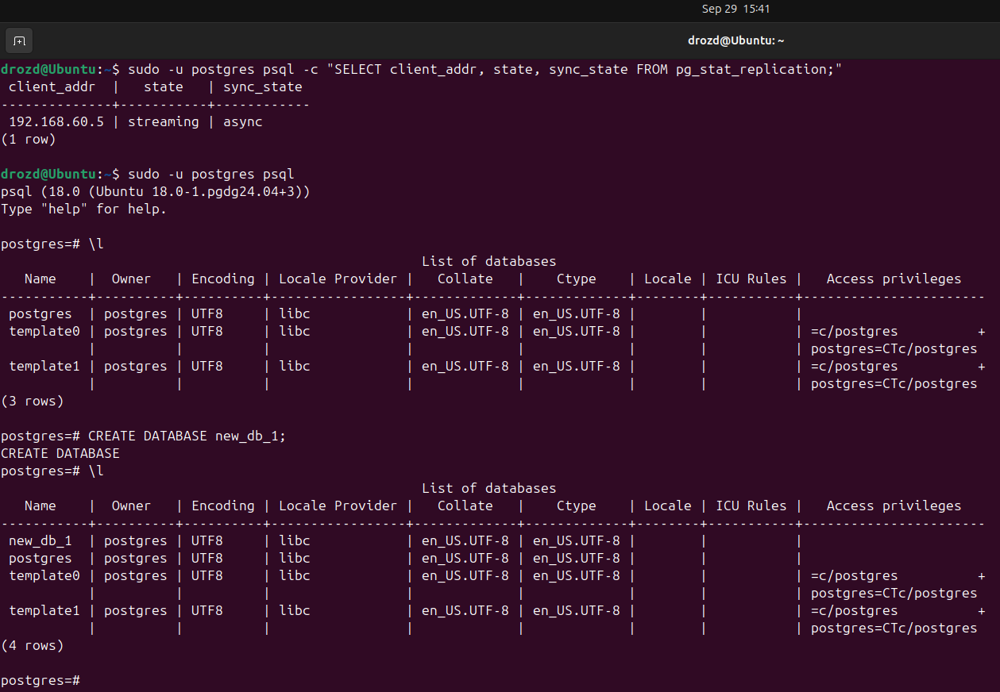

# Домашнее задание к занятию "`Репликация и масштабирование. Часть 1`" - `Гривняшкин Роман`  

---

### Задание 1  

`При master-slave есть четкое определение эталонного истоника знаний. Один говорит - другие слушают. Как на лекции в аудитории.`
`При master-master таких "эталонов" несколько и есть сложности с тем, как их помирить. Я не погружался еще в этот омут субординации между ними. Сомнительное преимущество заключается в том, что нет переключения и выборов на звание нового Мастера.`

---

### Задание 2  
 
[Listing](replica.txt)

`Master`  
  
`Slave`  
  
