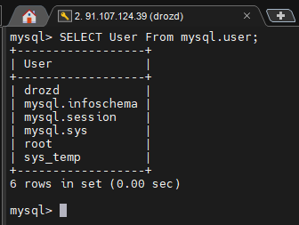
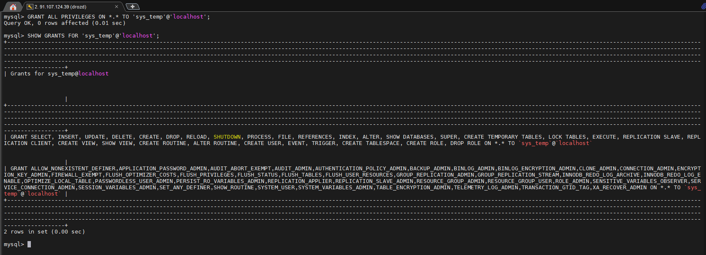
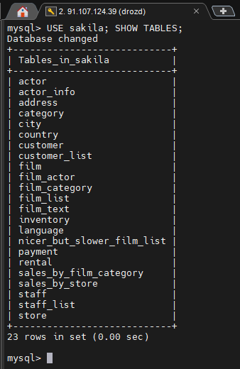

# Домашнее задание к занятию "`Работа с данными (DDL/DML)`" - `Гривняшкин Роман`

---

### Задание 1

1. `-- Создаем пользователя`  
`CREATE USER 'sys_temp'@'localhost' IDENTIFIED BY '********';`  

2. `-- Выводим пользователей`  
`SELECT User FROM mysql.user;`  
  

3. `-- Даем все права`  
`GRANT ALL PRIVILEGES ON *.* TO 'sys_temp'@'localhost';`  

4. `-- Смотрим права`  
`SHOW GRANTS FOR 'sys_temp'@'localhost';`  
  

5. `-- Переподключаемся`  
`mysql> exit`  
`> mysql -u sys_temp -p`  

6. `ALTER USER 'sys_temp'@'localhost' IDENTIFIED WITH mysql_native_password BY 'password';`  

7. `-- загружаем дамп`  
`mysql -u sys_temp -p < sakila-schema.sqlmysql -u sys_temp -p < sakila-schema.sql`  
`mysql -u sys_temp -p < sakila-data.sql`   

8. `-- Выводим таблицы`  
  

---

### Задание 2

`-- Выводим таблицы и первичные ключи`  
`SELECT  
    TABLE_NAME AS 'Название таблицы',    
    COLUMN_NAME AS 'Название первичного ключа'    
FROM INFORMATION_SCHEMA.KEY_COLUMN_USAGE  
WHERE TABLE_SCHEMA = DATABASE()  
AND CONSTRAINT_NAME = 'PRIMARY'  
ORDER BY TABLE_NAME;`  
  
[tables.txt](sql_2.txt)
